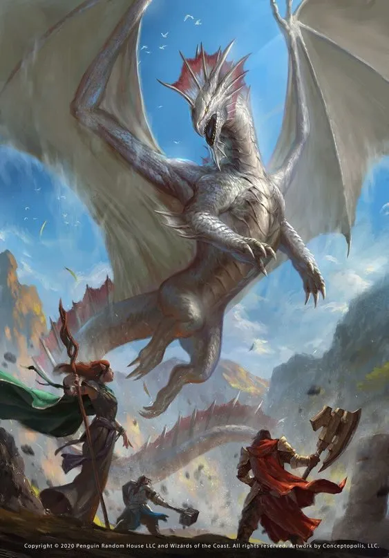
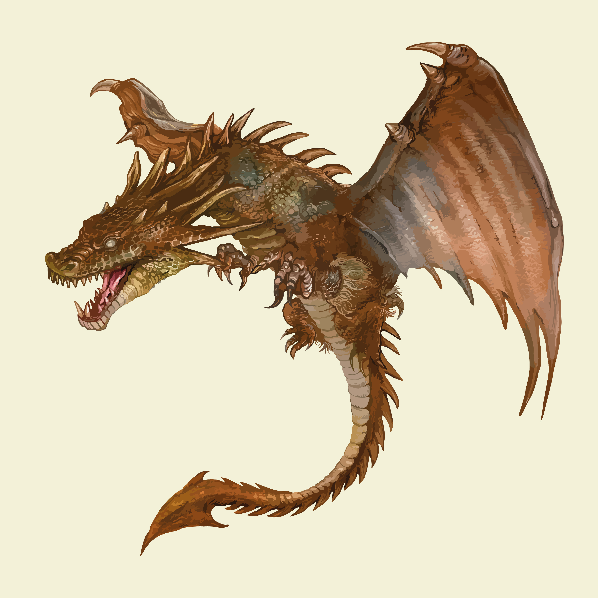

https://github.com/dvlaminck/Phylogenies

```{r}
NewDrag1XX <- "1001111111110000000001010001111011000010000000000111101000011100000???00011100"
strsplit(NewDrag1XX, "")[[1]]

NewDrag2XX <- "100101110000101000100001001110101100000000011010001100100001011000000010011100"
strsplit(NewDrag2XX, "")[[1]]

NewDrag3XX <- "110100110010000100100000000000110001101000001010001100010001011100000000011010"
strsplit(NewDrag3XX, "")[[1]]
```

```{r}
x <- c("NewDrag1XX", "NewDrag2XX", "NewDrag3XX")
y <- c("1001111111110000000001010001111011000010000000000111101000011100000???00011100", "100101110000101000100001001110101100000000011010001100100001011000000010011100", "110100110010000100100000000000110001101000001010001100010001011100000000011010" )
NewDragons <- data.frame(x,y)
print(NewDragons)
```

```{r}
write.csv(NewDragons, "NewDragons.nex")
```


```{r}
library(ape)
library(stringr)
library(ggtree)
```

Inputting the dataframe with new species:
```{r}
DragonNexus<-read.nexus.data("./data/DragonMatrix.nex")
tail(DragonNexus)
```
```{r}
names(DragonNexus)
```
```{r}
DragonNexusDF<-data.frame(matrix(unlist(DragonNexus), ncol=78,byrow=T))
row.names(DragonNexusDF)<-names(DragonNexus)
head(DragonNexusDF)
```
Applying weights to the traits:
```{r}
WeightsDat<-read.csv("./data/Weights.csv") #Uploading weights document
```
```{r}
Weights<-paste0(WeightsDat$Weight,collapse="") #Creating a single vector of weights
Weights<-strsplit(Weights,split="")[[1]]
```
```{r}
which(LETTERS=="G")
```
```{r}
WeightsNum<-rep(NA,length(Weights)) #Converting letters into values
for(i in 1:length(WeightsNum)){
  if(Weights[i] %in% LETTERS){WeightsNum[i]<-which(LETTERS==Weights[i])+9
  } else {
    WeightsNum[i]<-Weights[i]
    }
  }
WeightsNum<-as.numeric(WeightsNum) 
```
```{r}

```
```{r}
WtDragonNexus<-DragonNexus # Make a new weighted data frame object (weight value X trait for each dragon)
for (i in 1:length(DragonNexus)){
  RepWeight<-DragonNexus[[i]]==1
  WtDragonNexus[[i]][RepWeight]<-WeightsNum[RepWeight]
  RepWeight<-NA
}
```

Dragon 1:


Source: https://www.realmofhistory.com/2018/03/27/10-mythical-dragon-entities-facts/

Dragon 2:


Source: https://donjonetdragon.fr/

Dragon 3:


Source: https://www.freepik.com/free-vector/hand-drawn-dragon_4089180.htm#query=dragon&position=3&from_view=keyword&track=sph


Creating distance matrix for weighted traits:
```{r}
WtDragonNexusDF<-data.frame(matrix(unlist(WtDragonNexus),ncol=78,byrow=T))
row.names(WtDragonNexusDF)<-names(WtDragonNexus)
WtDragonDist<-dist(WtDragonNexusDF,method='euclidean')
WtDragonDistMat<-as.matrix(WtDragonDist)
```

Plotting the phylogenetic tree:
```{r}
WtDragonTreeNJ<-nj(WtDragonDist)
WtDTclade<-groupClade(WtDragonTreeNJ,.node=c(142))
ggtree(WtDTclade, layout="rectangular",aes(colour=group), xlab, linetype=7) +  geom_tiplab(size=1.7, linesize=.2, aes(align=TRUE)) + geom_nodepoint() + theme(legend.position='none')

```
Figure 1: Phylogenetic tree depciting the relationship of dragons, dragon-kin and dragonkind, as depicted in historical works of art. Dragons were qualitatively analyzed for a variety of traits, which were weighted and applied to each species. Tree was formed using neighbour-joining method. Nodes are depicted by circles representing speciation of dragons based on differing traits. Additional dragons added to the dataset are depicted in blue; based on this tree, they form a clade.

____________________________________________

Based on this phylogenetic tree, we can depict that dragons of Japanese origin are most similar to mammals. Due to the high amount of speciation within this dragon origin line, this makes sense; Dragons of Japanese origin are the most physiologically advanced. Before the extinction of dragons, the last known dragon colonies existed within Japan, allowing this origin a longer amount of time to evolve. 

The European dragons, most similar to fish, are a distinct group within this tree. Based on history, this is likely due to the limited interactions between these dragons with those of other origins. As the largest empire, Japan isolated their dragons from other populations. The Japanese felt their dragons were 'genetically superior,' and didn't want to risk interbreeding with other nations. In the Dragon War, Japan killed most dragons within Europe. Dragons of European origin, as a result, were less physiologically advanced and went extinct much earlier than other origins.  

With the insights of this tree, we are provided with further insights into the origin of our unknown dragon species. These unknown dragons are most similar in morphology to snakes. In 500 BC, a clan of dragons migrated from Japan to America. While the dragons of Japan continued to thrive for several 100s of year after migration, those that migrated to America were killed by the Lanisters and extinct merely 200 year later. During this time period, the dragons evolved to possess more snake-like qualities due to differences in climate between the two regions. Based of the speciation of the unknown dragons from Japanese ancestors, the unknown dragons are likely part of this clan. 


